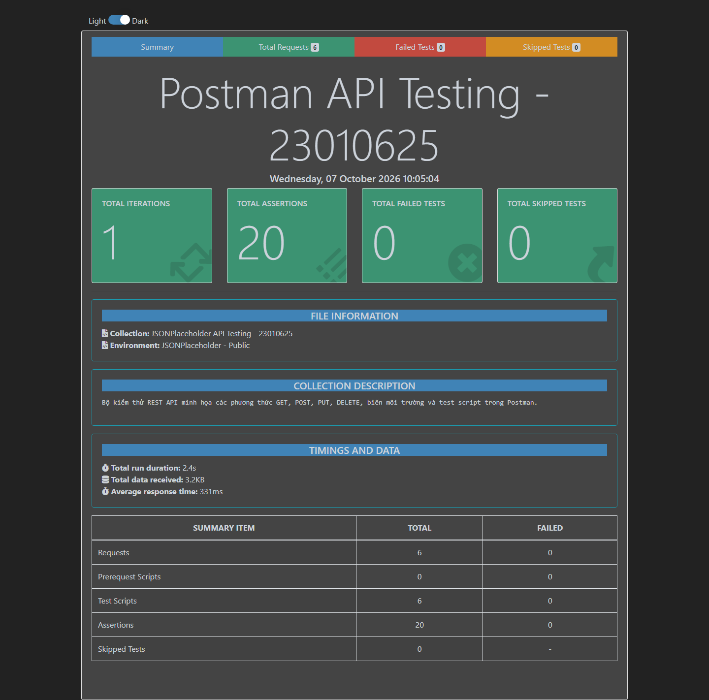
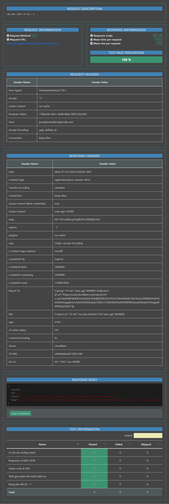

# Thực hành kiểm thử API bằng Postman

**Sinh viên:** Trần Văn Nhật  
**MSSV:** 23010625  
**Ngày thực hiện:** 07/10/2026

## 1. Mục tiêu

Bài thực hành sử dụng Postman để gửi request REST API, quản lý biến môi trường, viết test script và chạy tự động toàn bộ collection. API được chọn là [JSONPlaceholder](https://jsonplaceholder.typicode.com/) vì đây là API công khai dành cho học tập, không yêu cầu API key và hỗ trợ minh họa các phương thức HTTP phổ biến.

Sau bài thực hành, sinh viên có thể:

- Tạo và tổ chức request trong Postman Collection.
- Sử dụng biến môi trường `{{base_url}}` để tái sử dụng cấu hình.
- Gửi request với các phương thức `GET`, `POST`, `PUT`, `DELETE`.
- Truyền query parameter, header và JSON body.
- Viết assertion bằng `pm.test` và `pm.expect`.
- Chạy collection tự động bằng Collection Runner/Newman và đọc báo cáo kết quả.

## 2. Tài liệu đã tham khảo

- Video: [Postman API Testing Tutorial for beginners](https://www.youtube.com/watch?v=MFxk5BZulVU) — thời lượng 16 phút 44 giây.
- [Postman Learning Center](https://learning.postman.com/docs/getting-started/overview/).
- [Hướng dẫn viết test trong Postman](https://learning.postman.com/docs/tests-and-scripts/write-scripts/test-scripts/).
- [Tài liệu Newman](https://learning.postman.com/docs/collections/using-newman-cli/command-line-integration-with-newman/).
- [JSONPlaceholder Guide](https://jsonplaceholder.typicode.com/guide/).

## 3. Cấu trúc sản phẩm

```text
.
├── postman/
│   ├── JSONPlaceholder.postman_collection.json
│   └── JSONPlaceholder.postman_environment.json
├── reports/
│   └── newman-report.html
├── output/playwright/
│   ├── newman-summary.png
│   └── get-post-details.png
├── scripts/
│   └── serve-report.cjs
├── package.json
└── README.md
```

## 4. Thiết kế bộ kiểm thử

| STT | Request | Mục đích | Mã phản hồi mong đợi | Số assertion |
|---:|---|---|---:|---:|
| 1 | `GET /posts/1` | Lấy chi tiết bài viết | 200 | 5 |
| 2 | `GET /posts?userId=1` | Kiểm tra query parameter và dữ liệu trả về | 200 | 4 |
| 3 | `POST /posts` | Mô phỏng tạo bài viết mới | 201 | 4 |
| 4 | `PUT /posts/1` | Mô phỏng cập nhật toàn bộ bài viết | 200 | 3 |
| 5 | `DELETE /posts/1` | Mô phỏng xóa bài viết | 200 | 2 |
| 6 | `GET /posts/999` | Kiểm thử âm với tài nguyên không tồn tại | 404 | 2 |
| | **Tổng cộng** | | | **20** |

Các assertion kiểm tra status code, kiểu dữ liệu JSON, cấu trúc response, nội dung nghiệp vụ, lọc dữ liệu và thời gian phản hồi.

Ví dụ test script:

```javascript
pm.test("Status code là 200", () => pm.response.to.have.status(200));
pm.test("Đúng bài viết id = 1", () => {
  pm.expect(pm.response.json().id).to.eql(1);
});
pm.test("Thời gian phản hồi dưới 2000 ms", () => {
  pm.expect(pm.response.responseTime).to.be.below(2000);
});
```

## 5. Cách chạy bằng Postman

1. Mở Postman và chọn **Import**.
2. Import hai file trong thư mục `postman/`.
3. Chọn environment **JSONPlaceholder - Public**.
4. Mở collection **JSONPlaceholder API Testing - 23010625**.
5. Có thể bấm **Send** để chạy từng request hoặc chọn **Run collection** để chạy toàn bộ.
6. Kiểm tra cột **Passed/Failed** và chi tiết từng assertion.

## 6. Cách chạy tự động bằng Newman

Yêu cầu Node.js và npm. Tại thư mục repo, chạy:

```bash
npm install
npm test
```

Lệnh `npm test` thực thi collection bằng Postman Runtime và đồng thời tạo báo cáo tại `reports/newman-report.html`.

Để xem báo cáo qua localhost:

```bash
npm run report:serve
```

Sau đó mở `http://127.0.0.1:8765`.

## 7. Kết quả thực hiện

Lần chạy xác minh ngày 07/10/2026 cho kết quả:

| Chỉ số | Kết quả |
|---|---:|
| Iteration | 1 |
| Request đã chạy | 6 |
| Request thất bại | 0 |
| Test script đã chạy | 6 |
| Assertion đã chạy | 20 |
| Assertion thất bại | 0 |
| Tổng thời gian | 2,4 giây |
| Thời gian phản hồi trung bình | 331 ms |

### 7.1. Tổng quan kết quả Newman



### 7.2. Chi tiết request GET và các assertion

Ảnh dưới thể hiện request `GET /posts/1`, response `200 OK`, response body và 5/5 assertion đạt.



## 8. Nhận xét

- Biến môi trường giúp chuyển base URL mà không phải sửa từng request.
- Test script biến thao tác kiểm tra thủ công thành các assertion có thể chạy lặp lại.
- Collection Runner/Newman giúp phát hiện lỗi hồi quy nhanh và có thể tích hợp vào CI/CD.
- Kiểm thử âm là cần thiết: request `/posts/999` trả về `404 Not Found` nhưng vẫn được xem là **đạt** vì đúng với kết quả mong đợi.
- JSONPlaceholder chỉ mô phỏng các thao tác ghi. `POST`, `PUT`, `DELETE` trả response phù hợp nhưng không lưu thay đổi thật vào cơ sở dữ liệu.

## 9. Kết luận

Bộ kiểm thử đã bao phủ bốn phương thức HTTP cơ bản, query parameter, request body, status code, cấu trúc/nội dung response và một tình huống âm. Kết quả thực tế đạt **20/20 assertion**, không có request thất bại. Collection và environment trong repo có thể import trực tiếp vào Postman để kiểm tra lại.

